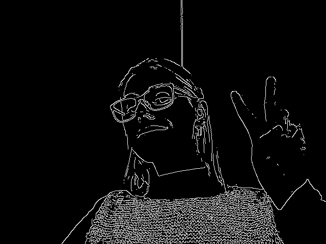
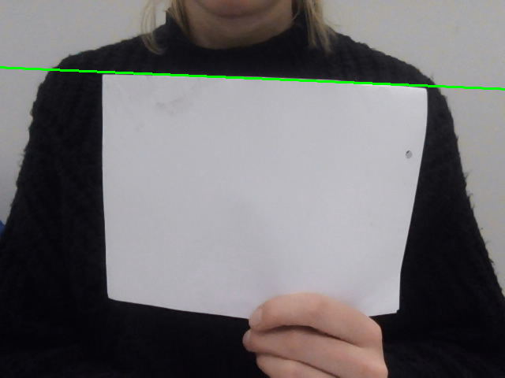
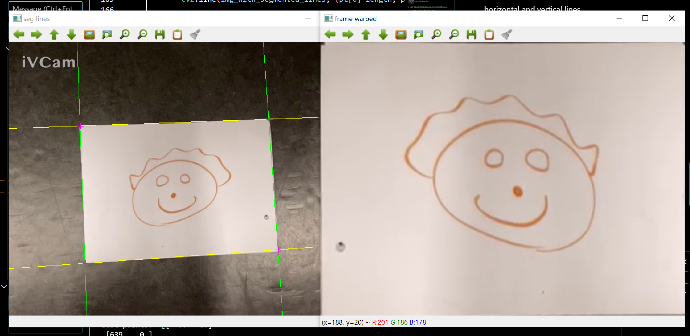

# Assignment 2

## Part I - Line detector

Detection and localization of a prominent straight edge in live video

- Capture an image from a video camera.

- Use an edge detector (such as Canny) to create an edge image.

Answer: was done by using the inbuilt function canny from opencv. Image with the Canny edge detector is below.

- Use RANSAC to fit a straight line with the greatest support to the extracted edge pixels.

- Display the line in the live image.

- Adjust the parameters of the edge detector and the RANSAC algorithm for best results at video rate.

### Questions to be answered

- How well your straight line detector follows the edge of a sheet of paper moved across the field of view of the camera.

Answer: The straight line detector follows the edge of a white paper sheet pretty well when the background is dark. But when the background has similar color to the paper sheet than the line jumps back and forth and is not stable.

- How well it detects other straight lines in your environment.

Answer: Pretty well but is rather jumpy. But was a lot more jumpy in the beginning, but after fixing the parameters a bit it got better.

- The processing time for one video frame or image.

Answer: When rolling through all edge points and jumping over 20 points the processing time for one video frame is about 0.2 second. But if there is not much happening in the video frame (in the background) then the processing time is faster, went to 0.05 second.
Also when I increased the number of points to jump over in the for loop, the processing time decreased but the line detector went to being more jumpy.

## Part II - Rectification

- Attempt to detect the four lines defining the edges of the quadrangle formed by the image of a rectangular shape.

Answer: To be able to detect lines and draw them out to the video image I conterted the original video frame to Canny edges, and found the lines using the inbuilt function cv2.HoughLines. Then used another method to draw the lines.

- Compute the intersections of the lines defining the four corners of the quadrangle.

Answer: Lines where split into two groups using kmeans which determenes wether the line is horizontal or vertical. After implementing this, the intersections could be found between the horizontal and vertical lines.

- Using the four corner locations, create a perspective transformation that maps to the corners of a new image, and warp the image content to the new image. 

Answer: To warp the points I sampled the intersection points and casted them into the inbuilt function from opencv named cv2.warpPerspective. Then I show the warped image.

- Display the rectified image.

### Questions to be answered

- The processing time for one video frame or image.

Answer: The processing time for one video frame is 0.004981 seconds. Is lot faster than the processing time in part 1. The reason for that is probably because using the Houglines method to find the lines is a lot faster than using the Ransac method.