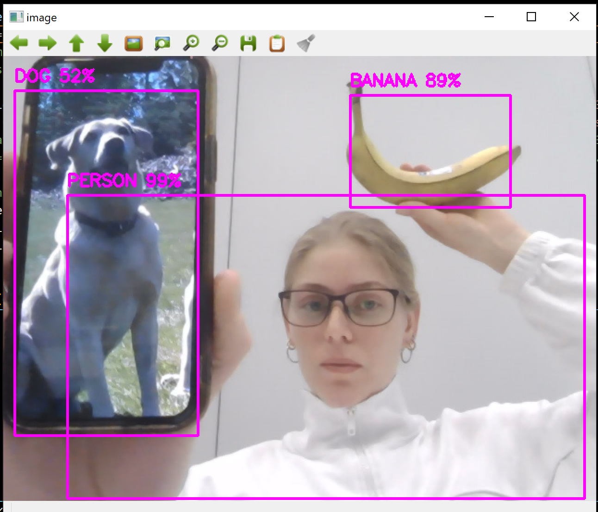
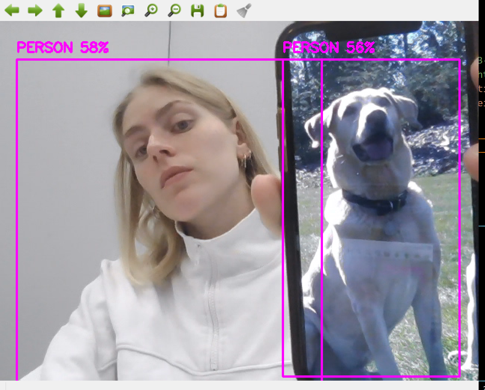

# Assignment 3

To be noted could not add files to github because they are too large for the github repository, to run code, able to dwl the files from the link below.
name of files = yolov3-320.cfg
yolo3-tiny.cfg
yolo3-tiny.weights
yolo3.weigths

Link below
[link to fetch yolo3 files](https://pjreddie.com/darknet/yolo/)

- Use the DNN module in OpenCV (in the core library as of v3.4.x) to load a pre-trained network.

- Capture images from the camera, and forward-pass each image through the network.

- Display the detected object bounding box and class in the live image.

Running the yolov3-320

Can detect many objects immediately. Also the confidence in predicting the objects is really good for the person and banana, not quite good for the dog. But the confidence for the image of the dog was quite jumpy. Flickered from 50 - 82%, the reason for the flickering could be because the algorithm was often detecting the phone which is showing the image of the dog.

Running the yolov3-tiny

Could not detect the dog on the image in the video frame, it predicted is as being a person. Also the confidence is a lot lower than when running the yolov3-320 script. But the frame rate is faster.

- Measure the frame rate achieved.  Compare using networks accepting two different image sizes.

Answer: The frame rate when running the yolov3.weights is aproximately = 0.18 seconds. When I ran the yolo3.tiny the frame rate is a lot faster = 0.0251 seconds. But the confidence when detecting objects in the video frame got worse. When I showed the video frame an image of a dog, it never got it right. Sometimes the algorithm detected a person. 

- Test on a live video feed (or by playing video on your phone) and roughly estimate the precision and recall.

Precision = TruePositives / (TruePositives + FalsePositives)
Recall = TruePositives / (TruePositives + FalseNegatives)

When running yolov3.weights and rougly estimating the precision and recall when using a banana
Precision = 9 / 9 + 0 = 100%
Recall = 9 / 9 + 1 = 90%

When running yolov3.weights and rougly estimating the precision and recall when using an image of a dog.
Precision = 9 / 9 + 0 = 100%
Recall = 9 / 9 + 0 = 100%

When running the yolo3.tiny and rougly estimating the precision and recall when using a banana.
Precision = 0%
Recall = 0%
could never detect the banana.

When running the yolo3.tiny and rougly estimating the precision and recall when using an image of a dog.
Precision = 0%
Recall = 0%
